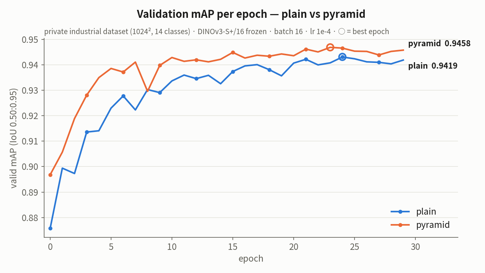
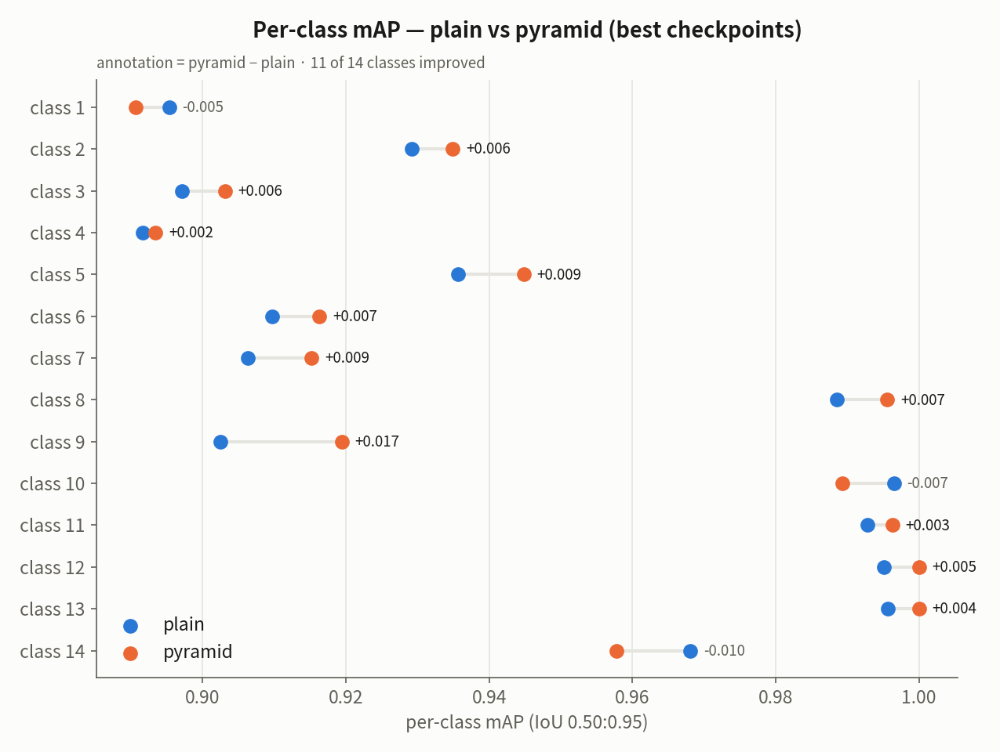
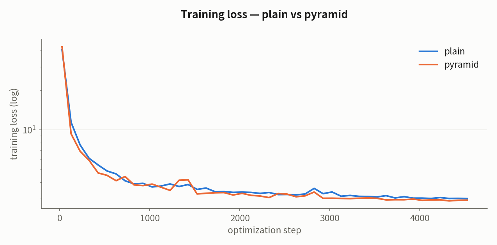

# Benchmark: plain vs pyramid adapter

A/B comparison between the **plain** adapter (all four feature maps at the ViT
patch stride of 16) and the **pyramid** adapter (`models/*_pyramid.py`,
ViTDet-style simple feature pyramid producing strides 4/8/16/32), trained under
identical conditions.

The benchmark was run on a **private industrial instance-segmentation dataset**
(not publicly available): 1024×1024 images, 14 classes, ~2.4k train / ~270 valid
images, up to 2 instances per image. Results on other datasets may differ.

## Setup (identical for both runs)

| Item | Value |
|---|---|
| Backbone | `facebook/dinov3-vits16plus-pretrain-lvd1689m` — **frozen** |
| Head | Mask2Former (initialized from swin-small-coco-instance) |
| Training | batch 16, lr 1e-4 polynomial, 30 epochs, bf16, seed 42, no augmentation |
| Evaluation | valid mAP (IoU 0.50:0.95), `--eval_score_threshold 0.05` |

## Results

| Metric (best checkpoint) | plain | pyramid | Δ |
|---|---|---|---|
| **mAP (0.50:0.95)** | 0.9431 (ep 24) | **0.9469 (ep 23)** | **+0.0038** |
| mAP@75 | 0.9996 | **1.0000** | +0.0004 |
| mAP medium | 0.9757 | **0.9769** | +0.0012 |
| mAP large | 0.9340 | **0.9383** | +0.0043 |
| Per-class | — | **11 of 14 classes improved** | up to +0.017 |
| Step throughput | 1.67 it/s | 1.56 it/s | ~7% slower |





## Takeaways

- The pyramid variant stays **consistently above the plain variant throughout
  training** and converges faster (0.928 vs 0.914 at epoch 3).
- Gains concentrate in the high-IoU regime (mAP@75, mAP 0.50:0.95), consistent
  with the expected effect of the stride-4 high-resolution features on mask
  boundary quality.
- The 3 regressed classes stay within −0.01, smaller than the typical gains;
  note this is a single-seed experiment, so treat the absolute gap (+0.004)
  as indicative rather than definitive.
- The dataset is easy enough that the plain variant already exceeds 0.94 mAP,
  so the absolute gap is small. For tasks where boundary precision matters
  (measurements, centerline extraction), the pyramid variant is the
  recommended default.

## Reproducing on your own data

```bash
# plain
accelerate launch --mixed_precision bf16 mask2former_dinov3_no_trainer_coco.py \
    --model models/mask2former_dinov3_vitsmallplus.py \
    --dataset_name /path/to/coco_dataset --output_dir output/plain \
    --image_height 1024 --image_width 1024 --do_reduce_labels \
    --per_device_train_batch_size 16 --learning_rate 1e-4 \
    --lr_scheduler_type polynomial --num_train_epochs 30 --seed 42 \
    --eval_score_threshold 0.05

# pyramid: same command with
#   --model models/mask2former_dinov3_vitsmallplus_pyramid.py --output_dir output/pyramid
```

Checkpoints are **not** weight-compatible between the two variants.
